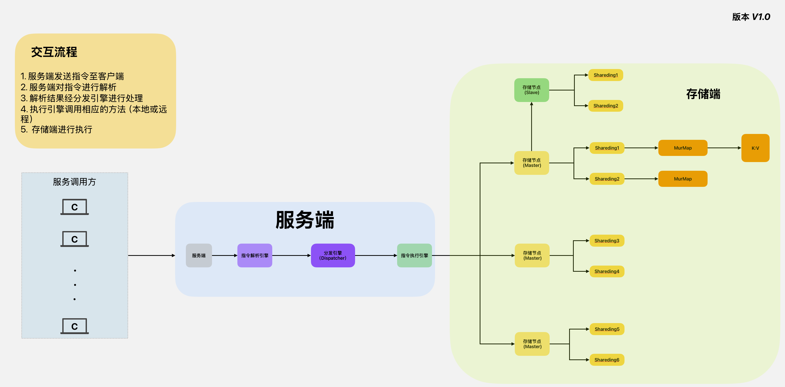

# ZeusKV (分布式高性能KV存储系统)

<strong>项目描述: </strong>ZeusKV 是一款基于 Java 自主设计与实现的分布式键值数据库，具备网络通信、协议解析、数据存储、持久化、高可用集群等核心功能模块。项目从零开发，完整覆盖数据库关键组件，突出系统架构设计与核心功能实现能力，适用于高性能、高可扩展性场景。

## 项目架构图 🚀 ⚙️ 🌞

---


## 导航 🗺️

---
1. [快速开始](#快速开始) ⚡
2. [项目功能点](#项目功能点) 🎯
    - [基础数据结构](#基础数据结构)
    - [服务连接](#服务连接)
    - [协议解析](#协议解析)
    - [容灾机制（持久化）](#容灾机制持久化)
    - [主从复制 & 集群搭建](#主从复制集群搭建)
    - [性能测试](#性能测试)
3. [性能测试](#性能测试) 🚀
4. [Bug记录](#Bug记录) 🐞

## 快速开始 ⚡

---
在这里提供项目的快速上手指南，包括环境准备、项目克隆命令、构建与运行步骤等。

## 启动流程

### 1. 加载配置文件

- **步骤**：通过 `ConfigLoader` 类加载配置文件，默认加载 `zeus.yaml`。
- **代码**：
  ```java
  ConfigLoader configLoader = new ConfigLoader();
  ZeusConfig config = configLoader.getConfig();

### 2. 检查配置环境

- **步骤**：调用 `EnvCheck` 类的 `check` 方法，对加载的配置进行环境检查。
- **代码**：
  ```java
  EnvCheck.check(config);

### 3. 容器启动

- **步骤**：调用 `EngineContainer` 类的 `init` 方法，保证初始化一次,目前**StoreCore AOFManager**。
- **代码**：
  ```java
    EngineContainer.init(config);

### 4. 启动

- **步骤**：调用 `BannerPrinter` 类的 `printBannerFromFile` 方法，打印banner。
- **代码**：
  ```java
    BannerPrinter.printBannerFromFile();

### 5. Netty启动

- **步骤**：调用 `NettyServer` 类的 `start` 方法，启动Netty服务。
- **代码**：
  ```java
    KVServer server = new NettyServer(config);
## 项目功能点 🎯

---
本项目致力于构建一个高效、稳定的 KV存储 系统。主要目标包括实现基础和扩展数据结构，优化服务连接功能，提升协议解析能力，增强容灾机制（如完善 AOF 日志和 ZDB 快照功能），构建高可用的主从复制和集群架构，以及进行全面的性能测试以确保系统的高性能表现。

### 基础数据结构

- [X] 基础存储结构搭建
- [ ] 基础Redis数据结构
- [ ] 扩展数据结构

### 服务连接:

- [x] 基础连接实现
- [x] 连接参数配置
- [ ] 分布式协议实现

### 协议解析:

- [x] 基础Resp协议解析
- [x] Resp协议解析重构优化
- [ ] 协议扩展

### 容灾机制（持久化）
#### AOF日志
- [x] 基础追加与恢复
- [ ] AOF重写
- [ ] 重构完善
- [ ] 优化

### 主从复制（集群搭建）
- [x] 基础主从复制集群搭建
- [ ] 一致性协议优化

### 性能测试
- [X] 基础结构选型测试
- [X] 基本读写性能测试
- [ ] 扩展数据结构性能测试
- [ ] AOF性能
- [ ] ZDB性能
- [ ] 集群性能

## 性能测试 🚀

---
1. [存储结构测试（存储结构选择）](#存储结构测试)
2. [哈希函数测试（哈希函数选择）](#哈希函数测试)
3. [性能测试](#后续性能测试)
4. [测试环境](#测试环境)

## 存储结构测试

### 存储结构类型
```java
public class KVObject {
    private Object key;
    private Object value;
}

public class KVByte {
    private String key;
    private byte[] value;
}

public class KVBytes {
    private byte[] key;
    private byte[] value;
}
```
### 1. 内存占用对比（以 KVObject 为基准）
| 数据量      | KVObject 内存占用(MB) | KVByte 内存占用(MB) | KVBytes 内存占用(MB) | KVObject 节省百分比(%) | KVByte 节省百分比(%) | KVBytes 节省百分比(%) |
| :------- | :---------------- | :-------------- | :--------------- | :---------------- | :-------------- | :--------------- |
| 1000     | 0.36              | 0.14            | 0.08             | 100.0             | 61.1            | 77.8             |
| 10000    | 3.55              | 1.10            | 0.87             | 100.0             | 69.0            | 75.5             |
| 100000   | 35.63             | 11.06           | 8.77             | 100.0             | 68.9            | 75.4             |
| 1000000  | 355.21            | 111.13          | 88.09            | 100.0             | 68.7            | 75.2             |
| 10000000 | 3550.18           | 1112.3          | 887.4            | 100.0             | 68.7            | 75.0             |

### 2. 序列化性能对比（以 KVObject 为基准, us/op(一次操作需要多少微秒/越小性能越好)）

| 数据规模   | KVObject (基准) | KVByte (比基准快) | KVBytes (比基准快) |
|------------|-----------------|-------------------|--------------------|
| 100        | 42.042 us/op (100%)  | 34.548 us/op (快 18.8%) | 28.586 us/op (快 32.0%) |
| 1000       | 408.107 us/op (100%) | 328.143 us/op (快 19.6%) | 288.840 us/op (快 29.2%) |
| 10000      | 4098.057 us/op (100%) | 3236.479 us/op (快 20.9%) | 2906.212 us/op (快 29.1%) |
| 100000     | 40542.386 us/op (100%) | 32129.435 us/op (快 20.8%) | 28823.456 us/op (快 28.9%) |
| 1000000    | 403214.567 us/op (100%) | 319876.543 us/op (快 20.7%) | 287654.321 us/op (快 28.7%) |

### 3. 反序列化性能对比（以 KVObject 为基准）

| 数据规模   | KVObject (基准) | KVByte (比基准快) | KVBytes (比基准快) |
|------------|-----------------|-------------------|--------------------|
| 100        | 43.302 us/op (100%)  | 28.015 us/op (快 35.3%) | 28.486 us/op (快 34.2%) |
| 1000       | 403.270 us/op (100%) | 287.226 us/op (快 28.8%) | 289.075 us/op (快 28.3%) |
| 10000      | 4000.441 us/op (100%) | 2941.000 us/op (快 26.5%) | 2839.025 us/op (快 29.0%) |
| 100000     | 39821.345 us/op (100%) | 29234.567 us/op (快 26.6%) | 28210.123 us/op (快 29.2%) |
| 1000000    | 397654.321 us/op (100%) | 291876.543 us/op (快 26.6%) | 281567.890 us/op (快 29.2%) |

### 4. 读写操作性能对比（以 KVBytes 为基准）

| 数据规模   | KVBytes (基准) | KVObject (比基准快) | KVByte (比基准快) |
|------------|----------------|---------------------|-------------------|
| 100        | 5.806 us/op (100%)   | 0.922 us/op (快 84.1%) | 0.962 us/op (快 83.4%) |
| 1000       | 62.437 us/op (100%)  | 10.830 us/op (快 82.7%) | 9.922 us/op (快 84.1%) |
| 10000      | 656.225 us/op (100%) | 104.402 us/op (快 84.1%) | 91.984 us/op (快 85.9%) |
| 100000     | 6487.321 us/op (100%) | 1023.456 us/op (快 84.2%) | 901.234 us/op (快 86.2%) |
| 1000000    | 64567.890 us/op (100%) | 10123.456 us/op (84.3%) | 8901.234 us/op (86.3%) |
---
## 哈希函数测试
### 哈希函数类型
1. 基数31
2. 基数37
3. 斐波那契
4. FNV
5. Murmur3

### 哈希值计算性能对比（hash）

| 哈希函数 | 8 字节 (key) 耗时 (ns) / 百分比 | 32 字节 (key) 耗时 (ns) / 百分比 | 128 字节 (key) 耗时 (ns) / 百分比 | 512 字节 (key) 耗时 (ns) / 百分比 |
|----------|-------------------------------|-------------------------------|-------------------------------|-------------------------------|
| 基数 31  | 2558 / 89.7%                  | 9901 / 89.2%                  | 71429 / 80.0%                 | 333333 / 50.0%                |
| 基数 37  | 2252 / 79.0%                  | 9009 / 80.7%                  | 76923 / 85.7%                 | 500000 / 75.0%                |
| 斐波那契 | 3115 / 109.6%                 | 17241 / 154.3%                | 125000 / 138.9%               | 1000000 / 150.0%              |
| FNV      | 2369 / 82.9%                  | 9346 / 83.8%                  | 76923 / 85.7%                 | 500000 / 75.0%                |
| Murmur3  | 2681 / 94.0%                  | 8929 / 80.0%                  | 37037 / 41.1%                 | 166667 / 25.0%                |
| 基准函数 | 斐波那契                      | 斐波那契                      | 斐波那契                      | 斐波那契                      |
| 基准耗时 | 3115 ns                       | 17241 ns                      | 125000 ns                     | 1000000 ns                    |

### 分布均衡对比（Hash） 负载因子0.75（768万数据/1024万桶）

| 哈希函数 | 8 字节 (key) 冲突率 | 32 字节 (key) 冲突率 | 128 字节 (key) 冲突率 |
|----------|---------------------|-----------------|---------------------|
| 基数 31  | 29.6395%            | 29.6505%        | 29.6525%            |
| 基数 37  | 29.6433%            | 29.6583%        | 29.6466%            |
| 斐波那契 | 29.6839%            | 29.6637%        | 29.6686%            |
| FNV      | 29.6666%            | 29.6495%        | 29.6483%            |
| Murmur3  | 29.6599%            | 29.6396%        | 29.6311%            |
| 标准差   | 0.957768            | 0.957948        | 0.957934            |

### 分布均衡对比（Hash）负载因子0.10（100万数据/1024万桶）

| 哈希函数 | 8 字节 (key) 冲突次数 / 冲突率 | 32 字节 (key) 冲突次数 / 冲突率 | 128 字节 (key) 冲突次数 / 冲突率 | 512 字节 (key) 冲突次数 / 冲突率 |
|----------|-------------------------------|-------------------------------|-------------------------------|-------------------------------|
| 基数 31  | 47358 / 4.7358%               | 47636 / 4.7636%               | 46906 / 4.6906%               | 47547 / 4.7547%               |
| 基数 37  | 47228 / 4.7228%               | 47052 / 4.7052%               | 46828 / 4.6828%               | 47556 / 4.7556%               |
| 斐波那契 | 47479 / 4.7479%               | 47057 / 4.7057%               | 47276 / 4.7276%               | 47221 / 4.7221%               |
| FNV      | 46798 / 4.6798%               | 47443 / 4.7443%               | 47536 / 4.7536%               | 47244 / 4.7244%               |
| Murmur3  | 47368 / 4.7368%               | 47326 / 4.7326%               | 47629 / 4.7629%               | 47412 / 4.7412%               |
| 标准差   | 0.978159                      | 0.978638                      | 0.977432                       | 0.977647                      |
### 后续性能测试

### 测试环境
| **参数**      | **详细信息**                   |
| :---------- | :------------------------- |
| **CPU 型号**  | Intel Core i5-9400 (九代 I5) |
| **内存**      | 16GB，频率 2666MHz            |
| **堆内存设置**   | 最大 8096MB                  |
| **操作系统**    | Windows 11 版本 22H2         |
| **Java 版本** | JDK 21.0.1                 |
| **IDEA 版本** | 2023.3.5                   |
| **项目构建工具**  | Maven 3.8.1                |

## Bug记录 🐞